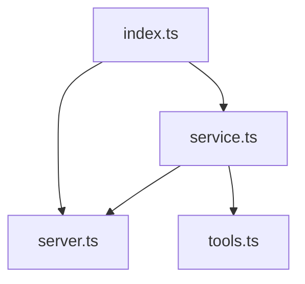
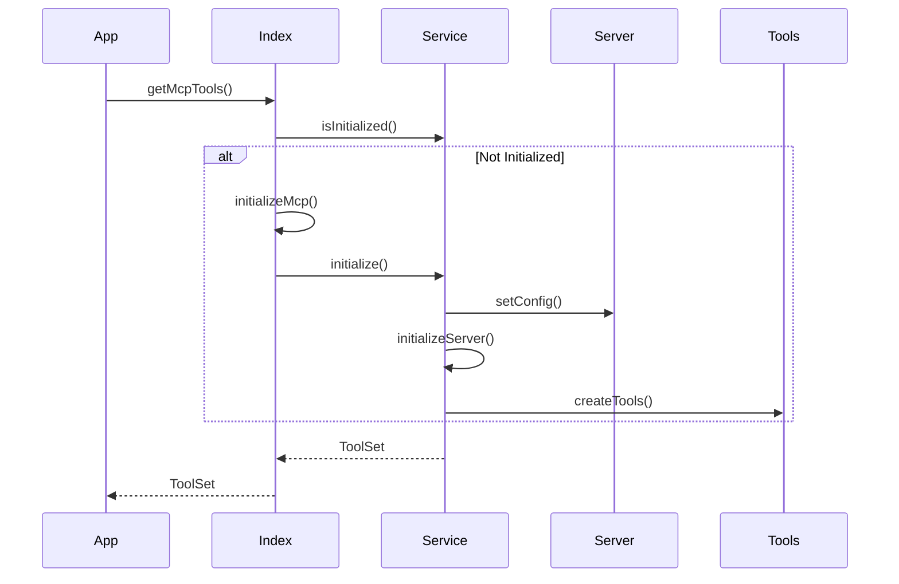
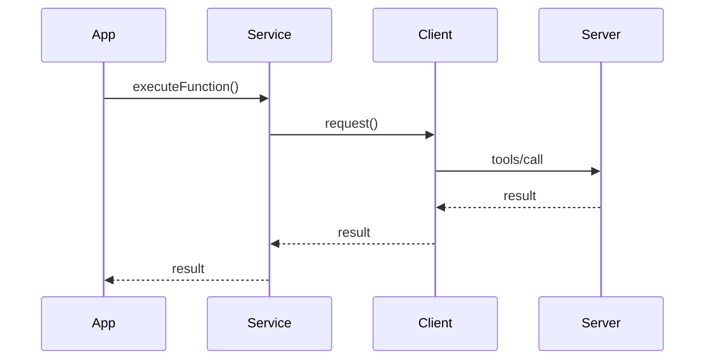
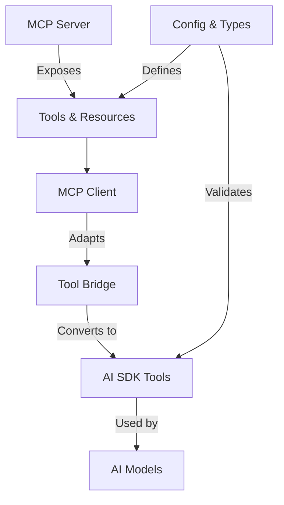
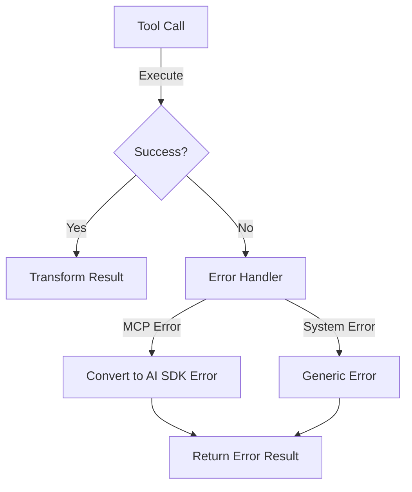

# MCP AI SDK Bridge Documentation

## Module Structure



IMPORTANT:

- read the node modules for ai-sdk in folder node_modules/ai
- read the node modules for modelcontextprotocol in folder node_modules/@modelcontextprotocol
- Do not make up the things, if you need any more information. please ask

## File Responsibilities

### 1. `index.ts` - Entry Point & Configuration

- **Purpose**: Main entry point, configuration management, and public interface
- **Exports**:
  - Types: `MCPConfig`, `ServerConfig`, `MCPToolResult`
  - Functions:
    - `initializeMcp(options: { configPath?: string, debug?: boolean })`
    - `getMcpTools(options: { debug?: boolean })`
    - `executeMcpFunction(serverName, functionName, args)`
  - Configuration:
    - Schema validation
    - Config loading/saving
    - Default configurations

### 2. `service.ts` - Service Layer

- **Purpose**: Manages MCP service lifecycle and tool execution
- **Class**: `MCPService`
  - Private State:
    - `clients: Map<string, Client>`
    - `transports: Map<string, StdioClientTransport>`
    - `tools: Map<string, ToolSet>`
    - `initialized: boolean`
  - Methods:
    - `getInstance(): MCPService`
    - `initialize(): Promise<void>`
    - `cleanup(): Promise<void>`
    - `getTools(options): Promise<ToolSet>`
    - `executeFunction(serverName, functionName, args): Promise<any>`
    - `isInitialized(): boolean`

### 3. `server.ts` - Server Management

- **Purpose**: Handles server lifecycle and communication
- **Class**: `MCPServerManager`
  - Features:
    - Multi-protocol support (stdio, http, sse)
    - Process management
    - Port allocation
    - Connection handling
  - Methods:
    - `getInstance(): MCPServerManager`
    - `startServer(serverName: string)`
    - `stopServer(serverName: string)`
    - `getServerInfo(serverName: string)`
    - `getRunningServers(): string[]`

### 4. `tools.ts` - Tool Utilities

- **Purpose**: Schema handling and tool conversion
- **Features**:
  - JSON Schema to Zod conversion
  - Type-safe tool definitions
  - Comprehensive logging
- **Exports**:
  - Types: `ServerTool`, `LogOptions`
  - Functions:
    - `jsonSchemaToZod(schema: JSONSchema7Definition)`
    - `createDefaultSchema(): z.ZodType`
    - `log(message, data?, options?)`
  - Schemas:
    - `ListToolsResultSchema`
    - `CallToolResultSchema`

### 5. `config.ts` - Configuration Management

- **Purpose**: Configuration loading and validation
- **Exports**:
  - Functions:
    - `loadMcpConfig(configPath: string)`
    - `saveMcpConfig(config: MCPServersConfig, path: string)`
    - `validateServerConfig(config: ServerConfig)`
  - Constants:
    - `defaultConfig: MCPServersConfig`

## Initialization Flow



## Tool Execution Flow



## Best Practices

1. **Initialization**:

   - Always use `getMcpTools()` for automatic initialization
   - Use `initializeMcp()` directly only for custom configuration

2. **Configuration**:

   - Prefer configuration file over manual setup
   - Always validate server configurations
   - Use environment variables for sensitive data

3. **Tool Management**:

   - Access tools through the service layer
   - Handle cleanup properly on shutdown
   - Use type-safe interfaces for tool execution

4. **Error Handling**:
   - Log errors with proper context
   - Clean up resources on failure
   - Provide meaningful error messages

## Common Modifications

1. **Adding a New Server**:

   ```typescript
   // In config.ts
   const newServerConfig = {
     command: 'npx',
     args: ['-y', 'my-server'],
     mode: 'stdio',
     env: {
       /* ... */
     },
   };
   ```

2. **Adding Custom Tool Types**:

   ```typescript
   // In tools.ts
   interface CustomTool extends ServerTool {
     customField: string;
   }
   ```

3. **Custom Initialization**:
   ```typescript
   // In application code
   await initializeMcp({
     configPath: './custom-config.json',
     debug: true,
   });
   ```

## Type Definitions

```typescript
// Core configuration types
interface MCPConfig {
  mcpServers: Record<string, ServerConfig>;
}

interface ServerConfig {
  command: string;
  args: string[];
  mode: 'http' | 'stdio' | 'sse';
  env?: Record<string, string>;
  port?: number;
  disabled?: boolean;
  sseOptions?: {
    endpoint: string;
    headers?: Record<string, string>;
    reconnectTimeout?: number;
  };
}

// Tool types
interface ServerTool {
  name: string;
  description?: string;
  inputSchema?: JSONSchema7;
}

interface MCPToolResult {
  content?: Array<{ text?: string }>;
  isError?: boolean;
}
```

## Overview

This document outlines the architecture and implementation requirements for bridging Model Context Protocol (MCP) servers with AI SDK tools. The bridge enables seamless integration between MCP-compliant servers and AI models through the AI SDK.

## Server Configuration

### MCP Config File (mcp.config.json)

The MCP configuration file defines server settings and capabilities:

```typescript
interface MCPServersConfig {
  mcpServers: {
    [serverName: string]: ServerConfig;
  };
}

interface ServerConfig {
  // Command to run (can be any CLI command)
  command: string; // e.g., "npx", "node", "uvx"

  // Command arguments
  args: string[]; // e.g., ["-y", "mcp-server-firecrawl"]

  // Server mode
  mode: 'stdio' | 'http' | 'sse';

  // Environment variables
  env?: Record<string, string>;

  // HTTP/SSE specific options
  port?: number;
  sseOptions?: {
    endpoint: string;
    headers?: Record<string, string>;
    reconnectTimeout?: number;
  };

  // Server state
  disabled?: boolean;
}
```

Example configurations for different modes:

```json
{
  "mcpServers": {
    // Stdio mode with npx
    "firecrawl": {
      "command": "npx",
      "args": ["-y", "mcp-server-firecrawl"],
      "mode": "stdio",
      "env": {
        "FIRE_CRAWL_API_KEY": "your-key",
        "FIRE_CRAWL_API_URL": "http://localhost:3002"
      }
    },

    // HTTP mode with node
    "httpServer": {
      "command": "node",
      "args": ["./build/server.js"],
      "mode": "http",
      "port": 3004,
      "env": {
        "PORT": "3004"
      }
    },

    // SSE mode with uvx
    "sseServer": {
      "command": "uvx",
      "args": ["run", "sse-server"],
      "mode": "sse",
      "sseOptions": {
        "endpoint": "http://localhost:3003/events",
        "headers": {
          "Authorization": "token"
        },
        "reconnectTimeout": 5000
      }
    }
  }
}
```

### Server Modes

1. **stdio Mode**

   - Direct process communication through stdin/stdout
   - Best for local tool execution
   - Supports all CLI commands (npx, node, uvx, etc.)
   - Example use: File operations, local computations

2. **HTTP Mode**

   - RESTful API communication
   - Supports remote tool execution
   - Requires port configuration
   - Example use: Web services, API integrations

3. **SSE Mode**
   - Server-Sent Events for real-time updates
   - Supports streaming responses
   - Requires endpoint and reconnection settings
   - Example use: Real-time data processing, notifications

### CLI Commands

The bridge supports various CLI commands for server execution:

1. **npx**

   ```json
   {
     "command": "npx",
     "args": ["-y", "package-name"]
   }
   ```

   - Used for running npm packages directly
   - Automatically handles package installation
   - Best for MCP server packages

2. **node**

   ```json
   {
     "command": "node",
     "args": ["./path/to/script.js"]
   }
   ```

   - Direct JavaScript/TypeScript execution
   - Better for custom server implementations
   - More control over execution environment

3. **uvx**
   ```json
   {
     "command": "uvx",
     "args": ["run", "script-name"]
   }
   ```
   - Alternative runtime for better performance
   - Similar to node but with optimizations
   - Useful for high-performance servers

### Command Resolution

The bridge handles command resolution in the following order:

1. Check if command exists in PATH
2. Look for local installation in node_modules/.bin
3. Fall back to global installation
4. Throw error if command not found

```typescript
function resolveCommand(command: string): string {
  // 1. Check PATH
  if (isInPath(command)) {
    return command;
  }

  // 2. Check local installation
  const localCommand = path.join(
    process.cwd(),
    'node_modules',
    '.bin',
    command
  );
  if (fs.existsSync(localCommand)) {
    return localCommand;
  }

  // 3. Check global installation
  try {
    const globalPath = execSync(`which ${command}`).toString().trim();
    return globalPath;
  } catch {
    throw new Error(`Command not found: ${command}`);
  }
}
```



## Architecture Overview

The MCP to AI SDK bridge is designed with a focus on simplicity for end users while handling complexity internally.

### User-Facing Interface

Users only need to:

1. Get tools from MCP servers
2. Pass them to AI SDK

```typescript
// Simple user workflow
const tools = await getMCPTools();
const result = await generateText({
  model: 'model-name',
  tools,
  messages: [
    /* ... */
  ],
});
```

All initialization, cleanup, and internal management is handled automatically by the bridge.

### Internal Architecture

The bridge internally manages:

1. Server lifecycle (start, stop, reconnect)
2. Connection management
3. Resource cleanup
4. Error handling and recovery

```typescript
// Internal implementation (not exposed to users)
class MCPBridge {
  private servers: Map<string, Server>;
  private connections: Map<string, Connection>;

  // Internal methods
  private async initialize(): Promise<void>;
  private async cleanup(): Promise<void>;
  private handleErrors(error: Error): void;

  // Only expose tool retrieval to users
  public async getTools(options?: { debug?: boolean }): Promise<ToolSet>;
}
```

## Core Components

### 1. Tool Provider (User-Facing)

```typescript
// The only interface users need to interact with
interface ToolProvider {
  // Get AI SDK compatible tools
  getTools(options?: { debug?: boolean }): Promise<{
    tools: ToolSet;
  }>;
}
```

### 2. Tool Bridge Layer (Internal)

```typescript
// Internal implementation - not exposed to users
interface MCPToolBridge {
  // Convert MCP tool schema to Zod schema
  convertSchema(mcpSchema: MCPSchema): z.ZodType;

  // Wrap MCP tool execution
  wrapExecution(
    mcpTool: MCPTool,
    options: ExecutionOptions
  ): ToolExecuteFunction;
}
```

### 3. Type Definitions

```typescript
// MCP Tool definition (internal)
interface MCPTool {
  name: string;
  description?: string;
  inputSchema: {
    type: string;
    properties: Record<string, unknown>;
    required?: string[];
  };
}

// AI SDK Tool definition (user-facing)
interface AISDKTool {
  parameters: z.ZodType;
  execute: ToolExecuteFunction;
  description?: string;
}
```

## Example Usage

```typescript
// 1. Get MCP tools (only step needed from users)
const tools = await getMCPTools();

// 2. Use with AI SDK
const result = await generateText({
  model: google('gemini-1.5-pro'),
  tools,
  messages: [{ role: 'user', content: 'Use the tools to help me...' }],
});

// No cleanup or initialization needed by users
```

## Implementation Requirements

### 1. Schema Conversion

- MCP JSON Schema → Zod Schema conversion must handle:
  - Basic types (string, number, boolean)
  - Object structures
  - Arrays
  - Optional fields
  - Nested schemas
  - Enums

Example:

```typescript
// MCP Schema
const mcpSchema = {
  type: 'object',
  properties: {
    url: { type: 'string' },
    options: {
      type: 'object',
      properties: {
        timeout: { type: 'number' },
      },
    },
  },
};

// Converted Zod Schema
const zodSchema = z.object({
  url: z.string(),
  options: z
    .object({
      timeout: z.number(),
    })
    .optional(),
});
```

### 2. Tool Execution Bridge

Must handle:

- Async execution
- Error handling
- Result transformation
- Progress reporting
- Resource cleanup

```typescript
async function bridgeToolExecution(
  mcpTool: MCPTool,
  args: any,
  options: ExecutionOptions
): Promise<ToolResult> {
  try {
    // 1. Validate arguments against schema
    const validatedArgs = validateArgs(args, mcpTool.inputSchema);

    // 2. Execute MCP tool
    const mcpResult = await executeMCPTool(mcpTool, validatedArgs);

    // 3. Transform result to AI SDK format
    return transformResult(mcpResult);
  } catch (error) {
    // Handle errors appropriately
    handleToolError(error);
  }
}
```

### 3. Error Handling



### 4. Configuration

```typescript
interface BridgeConfig {
  // Tool conversion options
  tools: {
    // Schema conversion options
    schema: {
      strictTypes: boolean;
      allowUnknownKeys: boolean;
    };
    // Execution options
    execution: {
      timeout: number;
      retries: number;
    };
  };
  // Error handling options
  errors: {
    detailedErrors: boolean;
    retryOnFailure: boolean;
  };
}
```

## Best Practices

1. **Type Safety**

   - Use strict type checking
   - Validate all schemas
   - Handle type conversions carefully

2. **Error Handling**

   - Provide clear error messages
   - Include error context
   - Handle both MCP and AI SDK errors
   - Clean up resources on error

3. **Resource Management**

   - Close connections properly
   - Handle timeouts
   - Implement proper cleanup
   - Monitor resource usage

4. **Testing**
   - Test schema conversions
   - Test error scenarios
   - Test resource cleanup
   - Test with different AI models

## Example Usage

```typescript
async function setupAIWithMCPTools() {
  // 1. Initialize MCP Service
  const mcpService = await initializeMCPService();

  // 2. Get MCP tools
  const { tools: mcpTools } = await mcpService.getTools({ debug: true });

  // 3. Convert to AI SDK tools
  const aiTools = convertTools(mcpTools);

  // 4. Use with AI SDK
  const result = await generateText({
    model: google('gemini-1.5-pro'),
    tools: aiTools,
    // ... other options
  });
}
```

## Common Issues and Solutions

1. **Schema Compatibility**

   - Issue: Complex MCP schemas not supported by AI SDK
   - Solution: Simplify schemas or implement custom conversion

2. **Type Mismatches**

   - Issue: Different type systems between MCP and AI SDK
   - Solution: Implement proper type conversion bridge

3. **Error Propagation**

   - Issue: Error context lost between systems
   - Solution: Implement comprehensive error wrapping

4. **Resource Leaks**
   - Issue: Connections not properly closed
   - Solution: Implement proper cleanup handlers

## Monitoring and Debugging

1. **Logging**

```typescript
interface BridgeLogger {
  toolCall(tool: string, args: any): void;
  schemaConversion(from: any, to: any): void;
  error(context: string, error: Error): void;
}
```

2. **Metrics**

```typescript
interface BridgeMetrics {
  toolCallDuration: Histogram;
  errorCount: Counter;
  schemaConversionTime: Histogram;
}
```

## Security Considerations

1. **Input Validation**

   - Validate all tool inputs
   - Sanitize file paths
   - Check URL safety
   - Prevent injection attacks

2. **Resource Limits**

   - Implement timeouts
   - Set memory limits
   - Rate limit requests
   - Monitor usage

3. **Error Information**
   - Sanitize error messages
   - Remove sensitive data
   - Log securely

## Tool Discovery and Updates

The bridge supports dynamic tool discovery as per MCP specifications:

```typescript
// Tool discovery events
interface ToolDiscovery {
  // List available tools
  listTools(): Promise<ToolSet>;

  // Subscribe to tool updates
  onToolsChanged(callback: (tools: ToolSet) => void): void;
}

// Example usage (internal)
class MCPBridge {
  private async handleToolUpdates() {
    this.client.on('notifications/tools/list_changed', async () => {
      const tools = await this.listTools();
      this.toolUpdateCallbacks.forEach(cb => cb(tools));
    });
  }
}
```

## Error Handling Patterns

Following MCP specifications, errors are handled within the result object:

```typescript
interface ToolResult {
  isError?: boolean;
  content: Array<{
    type: 'text' | 'image';
    text?: string;
    imageUrl?: string;
  }>;
}

// Example implementation
async function executeToolSafely(
  tool: MCPTool,
  args: unknown
): Promise<ToolResult> {
  try {
    const result = await tool.execute(args);
    return {
      content: [
        {
          type: 'text',
          text: JSON.stringify(result),
        },
      ],
    };
  } catch (error) {
    return {
      isError: true,
      content: [
        {
          type: 'text',
          text: `Error: ${error.message}`,
        },
      ],
    };
  }
}
```

## Security Considerations

### Input Validation

```typescript
// Schema validation
const validateInput = (input: unknown, schema: MCPSchema): void => {
  // Validate against JSON Schema
  const validator = new Validator(schema);
  const result = validator.validate(input);

  if (!result.valid) {
    throw new ValidationError(result.errors);
  }
};

// Path sanitization
const sanitizePath = (path: string): string => {
  return path.replace(/\.\./g, '').replace(/[<>:"|?*]/g, '');
};

// URL validation
const validateUrl = (url: string): boolean => {
  try {
    new URL(url);
    return true;
  } catch {
    return false;
  }
};
```

### Access Control

```typescript
interface SecurityConfig {
  // Rate limiting
  rateLimit: {
    maxRequests: number;
    windowMs: number;
  };

  // Authentication
  auth?: {
    type: 'bearer' | 'api-key';
    validate(token: string): Promise<boolean>;
  };

  // Audit logging
  audit: {
    logToolUsage(tool: string, user: string): Promise<void>;
    logError(error: Error, context: Record<string, unknown>): Promise<void>;
  };
}
```

## Testing Guidelines

1. **Unit Tests**

```typescript
describe('Tool Bridge', () => {
  test('schema conversion', () => {
    const mcpSchema = {
      type: 'object',
      properties: { name: { type: 'string' } },
    };
    const zodSchema = convertSchema(mcpSchema);
    expect(zodSchema).toBeDefined();
  });

  test('error handling', async () => {
    const result = await executeToolSafely(erroringTool, { invalid: 'args' });
    expect(result.isError).toBe(true);
  });
});
```

2. **Integration Tests**

```typescript
describe('MCP Integration', () => {
  test('tool discovery', async () => {
    const bridge = new MCPBridge();
    const tools = await bridge.getTools();
    expect(tools).toHaveProperty('length');
  });

  test('tool execution', async () => {
    const result = await generateText({
      model: 'test-model',
      tools: await getMCPTools(),
      messages: [{ role: 'user', content: 'test' }],
    });
    expect(result).toBeDefined();
  });
});
```

3. **Performance Tests**

```typescript
describe('Performance', () => {
  test('tool execution timing', async () => {
    const start = Date.now();
    await executeToolSafely(testTool, testArgs);
    const duration = Date.now() - start;
    expect(duration).toBeLessThan(1000);
  });
});
```

## Monitoring and Debugging

```typescript
interface Monitoring {
  metrics: {
    toolExecutionTime: Histogram;
    errorRate: Counter;
    toolUsage: Counter;
  };

  logging: {
    logToolExecution(tool: string, args: unknown): void;
    logError(error: Error, context: unknown): void;
    logPerformance(metric: string, value: number): void;
  };
}
```

## Tool Context and State Management

### Tool Context Preservation

The bridge ensures consistent context by providing these to the LLM with every tool call:

```typescript
interface ToolContext {
  // Complete tool definitions
  tools: {
    name: string;
    description: string;
    inputSchema: JSONSchema;
    examples?: Array<{
      input: unknown;
      output: unknown;
    }>;
  }[];

  // Previous tool executions in the conversation
  history: {
    toolName: string;
    input: unknown;
    output: unknown;
    timestamp: number;
  }[];

  // Current conversation state
  conversation: {
    messages: Message[];
    metadata: Record<string, unknown>;
  };
}
```

Example of context preservation:

```typescript
class MCPToolBridge {
  private toolContext: ToolContext;

  async executeWithContext(
    tool: MCPTool,
    args: unknown,
    conversation: Conversation
  ): Promise<ToolResult> {
    // 1. Update context with current state
    this.toolContext.conversation = conversation;

    // 2. Execute tool with full context
    const result = await this.executeToolSafely(tool, args);

    // 3. Record in history
    this.toolContext.history.push({
      toolName: tool.name,
      input: args,
      output: result,
      timestamp: Date.now(),
    });

    return result;
  }
}
```

### State Management

The bridge maintains consistent state through:

1. **Tool Registry**

```typescript
interface ToolRegistry {
  // Current set of available tools
  tools: Map<string, MCPTool>;

  // Tool metadata and capabilities
  metadata: Map<
    string,
    {
      isStateful: boolean;
      requiresAuth: boolean;
      rateLimit?: number;
    }
  >;

  // Active tool instances
  instances: Map<
    string,
    {
      tool: MCPTool;
      state: unknown;
      lastUsed: number;
    }
  >;
}
```

2. **State Persistence**

```typescript
interface StatePersistence {
  // Save tool state
  saveToolState(toolName: string, state: unknown): Promise<void>;

  // Restore tool state
  loadToolState(toolName: string): Promise<unknown>;

  // Clear tool state
  clearToolState(toolName: string): Promise<void>;
}
```

3. **State Synchronization**

```typescript
class StateManager {
  private registry: ToolRegistry;
  private persistence: StatePersistence;

  async syncToolState(toolName: string): Promise<void> {
    // 1. Get current instance
    const instance = this.registry.instances.get(toolName);

    // 2. Load persisted state
    const state = await this.persistence.loadToolState(toolName);

    // 3. Merge states
    if (instance && state) {
      instance.state = this.mergeStates(instance.state, state);
      instance.lastUsed = Date.now();
    }
  }
}
```

### Context Validation

To prevent hallucinations, the bridge validates:

1. **Tool Definitions**

```typescript
function validateToolDefinition(tool: MCPTool): void {
  // Ensure required fields
  if (!tool.name || !tool.inputSchema) {
    throw new Error('Invalid tool definition');
  }

  // Validate schema
  validateJsonSchema(tool.inputSchema);

  // Check examples if provided
  if (tool.examples) {
    tool.examples.forEach(example => {
      validateExample(example, tool.inputSchema);
    });
  }
}
```

2. **Execution Context**

```typescript
function validateExecutionContext(context: ToolContext, tool: MCPTool): void {
  // Verify tool exists in context
  if (!context.tools.find(t => t.name === tool.name)) {
    throw new Error('Tool not found in context');
  }

  // Validate conversation state
  if (!context.conversation?.messages) {
    throw new Error('Invalid conversation state');
  }

  // Check history consistency
  context.history.forEach(entry => {
    if (!entry.toolName || !entry.timestamp) {
      throw new Error('Invalid history entry');
    }
  });
}
```

3. **State Consistency**

```typescript
interface StateValidation {
  // Validate state transitions
  validateStateTransition(
    currentState: unknown,
    newState: unknown,
    tool: MCPTool
  ): boolean;

  // Check state invariants
  validateStateInvariants(state: unknown, tool: MCPTool): boolean;

  // Verify state consistency
  verifyStateConsistency(
    toolName: string,
    registry: ToolRegistry,
    persistence: StatePersistence
  ): Promise<void>;
}
```
